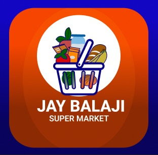

# Brand Identity: Jay Balaji Super Market
A comprehensive branding and logo design project for a local e-commerce grocery platform.

## 🎨 Final Logo Design

*Standalone vector app icon designed for high visibility and scalability.*

## 🎯 The Objective
To create a modern, vibrant, and highly recognizable app icon that communicates freshness, variety, and speed for a local supermarket brand. 

## 📱 App Icon Mockup

*Real-world preview of the icon in context on a mobile device.*

## 🛠️ Design Process & Tools
This project was designed entirely from scratch using **Figma**, focusing on clean vector geometry and scalable app icon standards.
* **Vector Illustration:** Built custom UI assets (basket, groceries, calyx) using Boolean operations, path flattening, and masking.
* **Color Psychology:** Utilized a high-contrast palette. The bright orange gradient base creates urgency and energy, while the fresh greens and blues communicate trust and natural produce.
* **Finishing Details:** Applied linear gradient overlays and blend modes (Soft Light/Overlay) to create a premium, glossy iOS-style glass reflection.

## 📬 Let's Connect
I am currently looking for design opportunities. Feel free to reach out!

* **Email:** [pondharani.devendra22@gmail.com](mailto:pondharani.devendra22@gmail.com)
* **LinkedIn:** [Pondharani Devendra](https://www.linkedin.com/in/pondharani-devendra-a809b339b?utm_source=share&utm_campaign=share_via&utm_content=profile&utm_medium=android_app)
